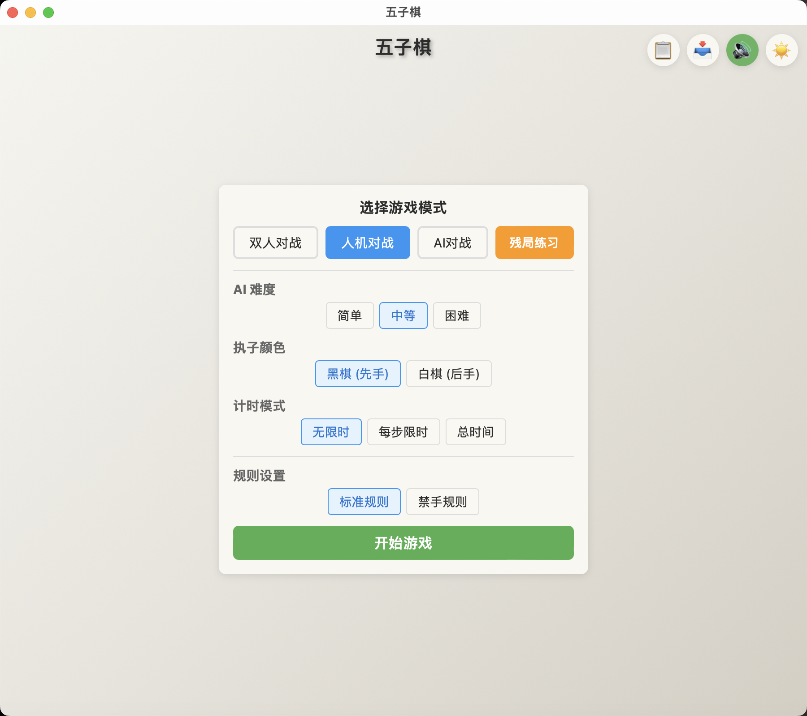
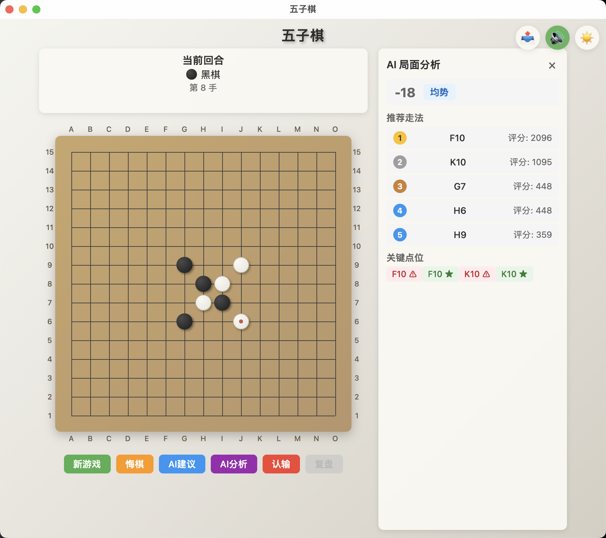

# 五子棋 (Gomoku)

一个使用 Tauri 2 + React + Rust 构建的现代化五子棋桌面游戏。支持多种游戏模式、AI 对战、残局练习等丰富功能。


## 📸 游戏截图

### 游戏首页


### 游戏页面


## ✨ 功能特性

### 🎮 游戏模式
| 模式 | 说明 |
|------|------|
| **双人对战 (PvP)** | 两人轮流落子，支持本地对战 |
| **人机对战 (PvAI)** | 与 AI 对战，三种难度可选（简单/中等/困难） |
| **AI 对战 (AIvAI)** | 观看两个 AI 对弈，可调节对弈速度 |
| **残局练习** | 50 道内置残局题目，五个难度等级（简单/中等/困难/专家/大师） |

### 🎯 游戏功能
- **悔棋** - PvAI 模式自动撤销两步（玩家和 AI 各一步）
- **认输** - 主动认输结束对局
- **AI 建议** - 获取当前最佳落子位置，显示为闪烁蓝色圆点
- **AI 分析** - 实时局面评估和推荐走法（侧边栏显示）
- **计时器** - 支持每步限时和总时间两种模式，超时自动判负
- **禁手规则** - 可选连珠规则（黑棋禁止三三、四四、长连）
- **棋盘坐标** - 显示 A-O 列和 1-15 行坐标
- **对局复盘** - 游戏结束后可复盘，支持步进浏览和自动播放
- **对局记录** - 自动保存对局历史（最多 50 条），支持查看和复盘
- **对局评分** - 游戏结束时自动评估对局质量（0-100 分）
- **棋谱导入导出** - 导出 JSON 格式棋谱，支持导入棋谱进行复盘

### ⚙️ 系统功能
- **音效系统** - 落子、获胜、失败音效（Web Audio API 动态生成）
- **主题切换** - 亮色、深色两种主题（亮色采用中国风设计，深色采用水墨画风格）
- **游戏统计** - 记录胜负场次和胜率
- **键盘快捷键** - 支持常用操作快捷键
- **无障碍访问** - 棋盘支持键盘导航和屏幕阅读器

## 📥 下载安装

### 直接下载

前往 [Releases](https://github.com/MrShenhongbo/gomoku-game/releases) 页面下载最新版本。

| 操作系统 | 安装包 | 说明 |
|---------|--------|------|
| Windows | `.msi` 或 `.exe` | 双击安装 |
| macOS (Apple Silicon) | `aarch64.dmg` | M 系列芯片 |
| macOS (Intel) | `x64.dmg` | Intel 芯片 |
| Linux (Debian/Ubuntu) | `.deb` | `sudo dpkg -i xxx.deb` |
| Linux (通用) | `.AppImage` | 添加执行权限后运行 |

#### macOS 安装说明

首次打开应用时，macOS 可能会提示"应用已损坏，无法打开"。这是因为应用未经过 Apple 开发者签名，macOS Gatekeeper 会阻止未签名的应用运行。

**解决方法：**

打开终端，执行以下命令移除隔离属性：

```bash
sudo xattr -cr /Applications/gomoku-game.app
```

然后重新打开应用即可正常运行。

> **说明：** 这不是应用真的损坏，而是 macOS 的安全机制。由于个人开发者签名需要付费的 Apple Developer Program 会员资格（$99/年），本项目暂未进行签名。如果您对安全性有顾虑，可以选择从源码自行构建。

### 从源码构建

#### 环境要求
- Node.js 18+
- Rust 1.77+
- 系统依赖（参考 [Tauri 官方文档](https://tauri.app/start/prerequisites/)）

#### 构建步骤

```bash
# 克隆仓库
git clone https://github.com/MrShenhongbo/gomoku-game.git
cd gomoku-game

# 安装依赖
npm install

# 开发模式运行
npm run tauri dev

# 构建生产版本
npm run tauri build
```

构建产物位于 `src-tauri/target/release/bundle/` 目录。

## 🎮 使用说明

### 快捷键

| 快捷键 | 功能 |
|--------|------|
| `Ctrl+Z` / `Cmd+Z` | 悔棋 |
| `Ctrl+N` / `Cmd+N` | 新游戏 |
| `H` | AI 建议 |
| `Esc` | 关闭对话框 |

### 游戏流程

1. 启动游戏后，在首页选择游戏模式
2. 根据模式设置难度、执子颜色、计时器等选项
3. 点击"开始游戏"进入对局
4. 游戏结束后可选择复盘或开始新游戏

## 🏗️ 技术架构

### 技术栈

| 层级 | 技术 |
|------|------|
| 前端框架 | React 19 + TypeScript |
| 构建工具 | Vite 7 |
| 桌面框架 | Tauri 2 |
| 后端语言 | Rust |
| AI 算法 | Minimax + Alpha-Beta 剪枝 |

### 项目结构

```
gomoku-game/
├── src/                    # 前端源码
│   ├── components/         # React 组件
│   │   ├── Board/          # 棋盘组件
│   │   ├── GameInfo/       # 游戏信息
│   │   ├── ControlPanel/   # 控制面板
│   │   ├── GameModeSelector/ # 模式选择
│   │   ├── Settings/       # 设置面板
│   │   ├── ReplayPanel/    # 复盘面板
│   │   ├── PuzzleMode/     # 残局练习
│   │   └── AnalysisPanel/  # AI 分析
│   ├── hooks/              # 自定义 Hooks
│   ├── api/                # Tauri API 封装
│   ├── contexts/           # React Context
│   └── types/              # TypeScript 类型
├── src-tauri/              # Rust 后端
│   └── src/
│       ├── commands/       # Tauri 命令
│       │   ├── game_commands.rs    # 游戏命令
│       │   ├── puzzle_commands.rs  # 残局命令
│       │   └── analysis_commands.rs # 分析命令
│       ├── game/           # 游戏逻辑
│       │   ├── board.rs    # 棋盘逻辑
│       │   ├── state.rs    # 状态管理
│       │   ├── rules.rs    # 规则判定
│       │   └── types.rs    # 类型定义
│       └── ai/             # AI 实现
│           ├── minimax.rs  # Minimax 算法
│           ├── evaluator.rs # 局面评估
│           └── transposition.rs # 置换表
└── screenshots/            # 游戏截图
```

## 🤖 AI 实现

AI 使用经典的 Minimax 算法配合多种优化技术：

### 核心算法
- **Minimax + Alpha-Beta 剪枝** - 减少搜索节点数
- **迭代加深 (Iterative Deepening)** - 逐步增加搜索深度，利用浅层结果优化排序
- **置换表 (Transposition Table)** - Zobrist 哈希缓存已搜索局面
- **Killer Move 启发** - 记录导致剪枝的走法，优先搜索

### 评估优化
- **按线评估** - 扫描 88 条线而非 225 个点，避免重复计算
- **快速位置评估** - 用于走法排序的轻量级评估函数
- **候选位置优化** - 只遍历已落子位置的邻域
- **Zobrist 表静态化** - 使用 `lazy_static` 将哈希表设为全局静态常量，避免重复计算

### 难度等级

| 难度 | 搜索深度 | 说明 |
|------|---------|------|
| 简单 | 2 层 | 适合初学者 |
| 中等 | 4 层 | 适合普通玩家 |
| 困难 | 6 层 | 具有挑战性 |

## 🤝 贡献指南

欢迎贡献代码、报告问题或提出建议！

### 如何贡献

1. Fork 本仓库
2. 创建特性分支 (`git checkout -b feature/AmazingFeature`)
3. 提交更改 (`git commit -m 'Add some AmazingFeature'`)
4. 推送到分支 (`git push origin feature/AmazingFeature`)
5. 创建 Pull Request

### 开发命令

```bash
# 启动开发服务器
npm run tauri dev

# 检查 Rust 代码
cd src-tauri && cargo check

# 运行 Rust 测试
cd src-tauri && cargo test

# 格式化 Rust 代码
cd src-tauri && cargo fmt

# Lint 检查
cd src-tauri && cargo clippy
```

### 报告问题

如果发现 Bug 或有功能建议，请在 [Issues](https://github.com/MrShenhongbo/gomoku-game/issues) 页面提交。

## 📄 许可证

本项目采用 MIT 许可证 - 详见 [LICENSE](LICENSE) 文件。

## 🙏 致谢

- [Tauri](https://tauri.app/) - 跨平台桌面应用框架
- [React](https://react.dev/) - 用户界面库
- [Vite](https://vitejs.dev/) - 前端构建工具
- [Rust](https://www.rust-lang.org/) - 系统编程语言
